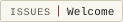

# Contributing

This is a personal publication. The repository is public so the site's
verification claims can be independently checked — not because the project
seeks contributions.

**Pull requests are generally declined.** The authored editions are a
personal record; the tooling changes only when the publication needs it to.

Issues are welcome for:

- factual errors in published content
- broken verification (a manifest, signature, mirror, or archive that does
  not check out)
- security reports — though for anything sensitive, use the channel in
  [SECURITY.md](SECURITY.md) instead of a public issue

There is no CLA, because there are no inbound contributions to cover.

## Asserting authorship

Contributing — whether an issue or a rare accepted change — asserts that you wrote
the work or otherwise have the right to submit it under the project's licences
(code MIT, content CC-BY-SA-4.0). Commits record that assertion on every commit by
being signed off:

    git commit -s

which adds a `Signed-off-by:` line: the Developer Certificate of Origin assertion.
Combined with the required cryptographic commit signature, each commit carries both
authorship and the right to contribute.

## Changes to tooling

A change to the build, gate or verification tooling that alters behaviour must add
or update a test under [`tools/quality/tests/`](tools/quality/tests/), so the
property holds on every future run. See [docs/CODE-REVIEW.md](docs/CODE-REVIEW.md)
for the full pre-merge checklist.
