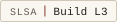

# trentpower.fr

[](https://trentpower.fr/en-au/verify/)
[](https://trentpower.fr/integrity.json)
[](docs/PROVENANCE.md)
[](https://www.bestpractices.dev/en/projects/13182/gold)
[](https://www.bestpractices.dev/en/projects/13182/baseline-3)
[](docs/COVERAGE.md)
[](https://api.reuse.software/info/github.com/trentpower/trentpower.fr)

`trentpower.fr` is a static, bilingual, source-verifiable personal publication.

It is generated from local source, published as static files, and accompanied
by signed integrity records, source mirrors, and per-edition release archives so
that each edition can be independently checked.

**Live:** <https://trentpower.fr>
**Source:** <https://github.com/trentpower/trentpower.fr>

> **Why this repository is public:** the site claims to be verifiable — signed
> manifests, source mirrors, release archives. Those claims only mean something
> if the source that produces them can be inspected. The repository is the
> deployment source too: what is deployed is exactly what is committed under
> `public/`. (`public/` history makes the clone heavy — a few GiB — by design.)

> **Reading the docs:** a print-ready editorial edition of the whole
> documentation, readable by technical and non-technical readers alike, is at
> [`README.pdf`](README.pdf). Its source lives in [`docs/pdf/`](docs/pdf/).

---

## Publication record

Every claim below is something you can check yourself, not a badge to take on faith.

| What                   | Status                                                                                       | Verify                                                                                                                         |
| ---------------------- | -------------------------------------------------------------------------------------------- | ------------------------------------------------------------------------------------------------------------------------------ |
| Integrity manifest     | every published file hashed (SHA-256), PGP-signed                                            | [`/integrity.json`](https://trentpower.fr/integrity.json) + `.sig`; [docs](docs/TRUST-AND-VERIFICATION.md)                     |
| Build provenance       | SLSA build-track Level 3 (Sigstore + Rekor)                                                  | `gh attestation verify trentpower-fr-<edition>-site.tar.gz --repo trentpower/trentpower.fr`; [docs](docs/PROVENANCE.md)        |
| Signed releases        | signed `edition/*` tags + GitHub Releases                                                    | [Releases](https://github.com/trentpower/trentpower.fr/releases); [docs](docs/PROVENANCE.md)                                   |
| SBOM                   | CycloneDX, build toolchain, per release                                                      | Release assets; [docs](docs/REPRODUCIBILITY.md)                                                                                |
| Reproducible build     | byte-deterministic archives                                                                  | [docs/REPRODUCIBILITY.md](docs/REPRODUCIBILITY.md)                                                                             |
| Content Credentials    | C2PA on shared media (architecture diagrams); self-signed, cross-referenced with the PGP key | signed [`/provenance/architecture.en.svg`](https://trentpower.fr/provenance/architecture.en.svg); [docs/C2PA.md](docs/C2PA.md) |
| Licensing              | REUSE 3.3; MIT (code) + CC-BY-SA-4.0 (content)                                               | [`REUSE.toml`](REUSE.toml), [`LICENSES/`](LICENSES/), [NOTICE.md](NOTICE.md)                                                   |
| Best practices         | OpenSSF Baseline (Silver)                                                                    | [bestpractices.dev/projects/13182](https://www.bestpractices.dev/projects/13182)                                               |
| Supply-chain posture   | OpenSSF Scorecard (a dashboard, not a medal)                                                 | [scorecard.dev](https://scorecard.dev/viewer/?uri=github.com/trentpower/trentpower.fr)                                         |
| Security policy        | coordinated disclosure, 14-day response                                                      | [SECURITY.md](SECURITY.md)                                                                                                     |
| Privacy                | no analytics, cookies, or third-party assets                                                 | [docs/SECURITY-AND-PRIVACY.md](docs/SECURITY-AND-PRIVACY.md)                                                                   |
| Continuous integration | PR checks · publication check · deploy                                                       | [Actions](https://github.com/trentpower/trentpower.fr/actions)                                                                 |
| Claims ledger          | every public claim bound to a passing control                                                | [docs/CLAIMS.md](docs/CLAIMS.md) (generated from `policy-data/claims-map.yml`); `make policy`                                  |

The fastest single check — confirm the live site is signed by the published key:

```sh
curl -fsS https://trentpower.fr/integrity.json      -o integrity.json
curl -fsS https://trentpower.fr/integrity.json.sig  -o integrity.json.sig
curl -fsS https://trentpower.fr/.well-known/pgp-key.asc | gpg --import
gpg --verify integrity.json.sig integrity.json      # expect: Good signature
```

---

## Principles

- **Static by default.** HTML, CSS, and vanilla JavaScript. No frameworks,
  bundlers, transpilers, or runtime dependencies.
- **Privacy-first.** No analytics, cookies, advertising identifiers,
  cross-site tracking, or third-party requests on page load. Browser storage
  stays same-origin and is limited to visitor-controlled preferences and the
  offline cache; the storage itself is never sent anywhere.
- **Verifiable.** Every public byte is captured in a SHA-256 manifest, signed
  with PGP, and exposed per-page at `/verify/`.
- **Bilingual authored editions.** `/en-au/` (English) and `/fr/` (French);
  English is the authored record and French is curated by hand. `/` is a
  lightweight language gate.
- **Deterministic build.** `bash tools/build/build.sh` produces byte-identical output
  across consecutive runs on the same machine (modulo PGP signature timestamps);
  independent off-machine reproduction is a stated goal, not yet a claim.
- **No LLM in the release path.** Language models may assist drafting and
  development, but the build → sign → verify → deploy pipeline runs with no AI,
  model, or external API dependency.

## Architecture

The site is built as two static authored trees plus a root language gate:

- `/en-au/`: English authored edition
- `/fr/`: French authored edition
- `/`: lightweight language gate

Content is authored in YAML and rendered through templates into static files;
trust surfaces (integrity manifest, source mirrors, release archives, verify /
integrity / source pages) are regenerated on every build. There is no runtime
CMS, no database, and no analytics.

Historical edition archive binaries are served from the canonical live archive
store at <https://trentpower.fr/integrity/releases/>. They are not committed to
Git, so GitHub source downloads stay light enough to unzip and build locally;
the repository keeps the verification logic, signed manifests and per-edition
checksum/signature records. See
[docs/ARCHIVE-STORAGE-AUDIT.md](docs/ARCHIVE-STORAGE-AUDIT.md).

See [docs/ARCHITECTURE.md](docs/ARCHITECTURE.md).

## Repository structure

```text
content/              Authored content (YAML) and the route registry
templates/            JS build inputs (app.template.js, cite.template.js)
styles/               Authored design source CSS (styles.src.css, print.src.css)
tools/                The pipeline, split into responsibility pillars:
  ├── build/          Creates the site (generators, renderers, build.sh, copy/)
  ├── quality/        Stops a bad release (gate.py, lint.py, validate_*)
  ├── verify/         Proves the release is genuine (read-only checks)
  ├── release/        Makes it public (archives, seal, deploy.sh)
  ├── config/         Declared facts (identity, public-exposure, overrides)
  ├── lib/            Shared across pillars (paths.py, checks.py)
  ├── score-ledger/   Local-only live-site audit tool (not a deploy gate)
  └── visual/         Repo-presentation + visual QA proofing (not a deploy gate)
public/               Generated public output, the live web root (tracked)
docs/                 Project documentation
.github/              Workflows (deploy, PR + publication checks), issue forms, ownership
```

`public/` is intentionally tracked: the deployed bytes are part of the trust
story (they are what the signed `integrity.json` attests to).

## Requirements

- Python 3 and Bash for the build pipeline.
- GnuPG for signing and verification.
- Optional dev tooling (Ruff, ShellCheck, Prettier, Stylelint) for the advisory
  quality checks. Missing local tools skip cleanly; CI installs the full set.

## Build

```sh
python3 tools/build/fetch_licensed_fonts.py   # fresh clone only: restore the
                                              # licensed fonts from the live host,
                                              # verified against integrity.json
bash tools/build/build.sh --check    # build + run the deploy gate, no re-signing
bash tools/build/build.sh            # full signed release build
```

The pipeline sweeps identity / edition / asset-version / CSP values, emits the
bilingual trees and the language gate, generates the service worker, hashes the
tree into `integrity.json`, mirrors source under `/source/`, signs the manifest,
builds per-edition release archives, then runs the gate.

See [docs/BUILD-AND-DEPLOYMENT.md](docs/BUILD-AND-DEPLOYMENT.md).

## Checks

```sh
python3 tools/quality/gate.py --all    # blocking, deploy-gating checks
python3 tools/quality/lint.py          # advisory quality checks
```

The gate is two-tier: `gate.py` runs the **blocking** security and correctness
checks (a failure blocks deploy); `lint.py` runs **advisory** quality checks.
Both draw from the registry in `tools/lib/checks.py`, which combines the
`validate_*` scripts with the inline checks in `tools/quality/inline_checks.py`.

The suite is **1,232** unit-test functions across **82** files — both counts are
source-derived by `coverage.sh` and held in lock-step here by
`sync_coverage.py --check` (a PR that changes the suite size but leaves these
numbers stale fails CI). See [docs/COVERAGE.md](docs/COVERAGE.md).

Documentation freshness is build-blocking. Public claims about tests, coverage,
badges, gates, signing, integrity, byte convergence and deployment must match the
repository state. The quality gate checks key documentation for stale paths, stale
badge/coverage values, broken internal links and contradictory claims.

See [docs/GATES-CHECKS-AND-QUALITY.md](docs/GATES-CHECKS-AND-QUALITY.md).

## Editing content

```sh
# Edit authored content (YAML); English regenerates, French is hand-edited
$EDITOR content/en/...           # source for the English edition
$EDITOR content/fr/...           # hand-edited French edition

# Edit JS behaviour: NEVER edit the generated public/*.js directly
$EDITOR templates/app.template.js
$EDITOR templates/cite.template.js

bash tools/build/build.sh        # rebuild; every derived surface updates in lockstep
```

See [docs/CONTENT-MODEL.md](docs/CONTENT-MODEL.md).

## Trust model

Each public edition is backed by:

- `integrity.json`: SHA-256 of every public file
- `integrity.json.sig`: detached PGP signature of the manifest
- a published public key at `/.well-known/pgp-key.asc`
- byte-equal source mirrors under `/source/`
- per-edition signed release archives under `/integrity/releases/<YYYY-MM-DD>/`
- per-page verification records at `/verify/`

Anyone can verify the live manifest in an isolated keyring:

```sh
tmpdir="$(mktemp -d)"; chmod 700 "$tmpdir"; export GNUPGHOME="$tmpdir"
ts=$(date +%s)
curl -fsS "https://trentpower.fr/.well-known/pgp-key.asc?ts=$ts" | gpg --import
curl -fsS "https://trentpower.fr/integrity.json?ts=$ts"     -o integrity.json
curl -fsS "https://trentpower.fr/integrity.json.sig?ts=$ts" -o integrity.json.sig
gpg --verify integrity.json.sig integrity.json
unset GNUPGHOME; rm -rf "$tmpdir" integrity.json integrity.json.sig
```

Expected: `Good signature from "Trent POWER <trent@trentpower.fr>"`, fingerprint
`A729 591B 450D 3F59 3694 98BD 8299 1F25 04AE 0263`.

See [docs/TRUST-AND-VERIFICATION.md](docs/TRUST-AND-VERIFICATION.md).

## Page provenance

Each generated page includes a quiet provenance record at the end of `<head>`,
set in the head's own design language: a one-line section comment followed by
a pretty-printed JSON block (`<script type="application/json"
id="tp-page-record">`) that is readable by humans and validation tooling
alike — canonical URL, repository, source path, template and edition:

```json
{
  "canonical": "https://trentpower.fr/en-au/security/",
  "sourceRepository": "https://github.com/trentpower/trentpower.fr",
  "sourcePath": "content/en/pages/security.yml",
  "sourceUrl": "https://github.com/trentpower/trentpower.fr/blob/main/content/en/pages/security.yml",
  "edition": "2026-06-14",
  "generated": true,
  "templatePath": "templates/pages/security.html"
}
```

`sourcePath` is the honest authored input — the content YAML for rendered
pages, the generator module for machine-assembled surfaces (`/tests/`,
`/documentation/`, the `/source/` catalogue and reader). `sourceUrl` is derived
as `repository.url + "/blob/" + repository.branch + "/" + sourcePath` from the
`repository` block in `tools/config/identity_canonical.json`, which is the
single source of truth alongside the edition date. Local build paths are
deliberately excluded: the public GitHub repository is the only source
location exposed in production HTML.

The record is injected by `tools/build/generate_provenance.py` during the
build (never hand-pasted), and the blocking gate
`tools/quality/validate_page_provenance.py` proves that every active page
carries exactly one coherent record, that canonical URLs match real routes,
that French pages point at French sources, and that no local or private path
fragment appears anywhere in public bytes. Frozen release snapshots under
`/integrity/releases/<edition>/` are sealed historical bytes and keep their
provenance in `release.json` instead.

## Privacy

No cookies, no advertising identifiers, no cross-site tracking, no third-party
requests on page load, no analytics or tracking pixels. Browser storage stays
within the same origin and is limited to visitor-controlled preferences
(language, appearance), first-visit markers, and the service-worker offline
cache; none of it is ever transmitted, and `/local/` enumerates every key the
visitor can clear. A strict Content Security Policy (`default-src 'none'`,
hashed inline JSON-LD only), cross-origin isolation, and HSTS back the posture;
`/.well-known/security.txt` and `/privacy/` make it machine-checkable.

See [docs/SECURITY-AND-PRIVACY.md](docs/SECURITY-AND-PRIVACY.md).

## Deployment

Deployment is static and SFTP-based via GitHub Actions. The runner does **not**
rebuild and **does not hold the PGP key**: it re-verifies `integrity.json.sig`
against the committed public key, uploads exactly the bytes already in `public/`
(a non-deleting two-pass mirror), then runs a post-deploy smoke test.

Secrets are configured in the repository, never committed:
`SFTP_HOST`, `SFTP_USERNAME`, `SFTP_PASSWORD`, `SFTP_REMOTE_PATH`, and (optional)
`SFTP_KNOWN_HOSTS` for SSH host-key pinning.

See [docs/BUILD-AND-DEPLOYMENT.md](docs/BUILD-AND-DEPLOYMENT.md).

## Documentation

Full documentation lives in [`docs/`](docs/README.md):

- [ARCHITECTURE.md](docs/ARCHITECTURE.md)
- [BUILD-AND-DEPLOYMENT.md](docs/BUILD-AND-DEPLOYMENT.md)
- [GATES-CHECKS-AND-QUALITY.md](docs/GATES-CHECKS-AND-QUALITY.md)
- [TRUST-AND-VERIFICATION.md](docs/TRUST-AND-VERIFICATION.md)
- [SECURITY-AND-PRIVACY.md](docs/SECURITY-AND-PRIVACY.md)
- [CONTENT-MODEL.md](docs/CONTENT-MODEL.md)
- [OPERATIONS.md](docs/OPERATIONS.md)
- [INCIDENT-RESPONSE.md](docs/INCIDENT-RESPONSE.md)
- [SCORE-LEDGER.md](docs/SCORE-LEDGER.md)
- [PUBLIC-READINESS.md](docs/PUBLIC-READINESS.md)
- [GITHUB-ENVIRONMENTS.md](docs/GITHUB-ENVIRONMENTS.md)
- [GITHUB-RULESETS.md](docs/GITHUB-RULESETS.md)
- [PROVENANCE.md](docs/PROVENANCE.md)
- [SECRETS-AND-KEY-MANAGEMENT.md](docs/SECRETS-AND-KEY-MANAGEMENT.md)
- [CODE-REVIEW.md](docs/CODE-REVIEW.md)

## Support

The current edition is the supported one. Each new edition supersedes the
previous one; it never rewrites it. Earlier editions remain published as frozen,
redistributable archives under
[`public/integrity/releases/`](public/integrity/releases/), kept so the record
stays verifiable, not maintained.

Security updates follow the same lifecycle: only the latest edition receives
fixes. Once an edition is superseded it is immutable and is not patched. A
security-relevant correction ships as a new edition and is noted in the
[changelog](https://trentpower.fr/changelog.txt); see [SECURITY.md](SECURITY.md)
for how to report an issue and the response timeframe.

## What is intentionally not included

- No frameworks, bundlers, transpilers, or runtime dependencies.
- No analytics, tracking, cookies, or advertising identifiers. (Browser storage
  is limited to visitor-controlled preferences and the offline cache; see
  Privacy.)
- No third-party scripts, fonts, or CDN resources; all assets are same-origin.
- No inline JavaScript or CSS.
- No build-time non-determinism.
- No LLM, AI API, or model dependency anywhere in the release pipeline.

## What is excluded from the repository, and why

- **Licensed typefaces.** The Klim Type Foundry fonts are served live under a
  commercial licence that prohibits redistribution, so they are not in the
  tree. `metadata/repo-exclusions.json` declares each one with the SRI digest
  of the live binary; `tools/build/fetch_licensed_fonts.py` restores them on a
  fresh checkout, verified against the signed `integrity.json`.
- **Private operational surfaces.** Keys, credentials, server configuration,
  and operator working notes never enter git; the policy and its enforcement
  are documented in [docs/PUBLIC-READINESS.md](docs/PUBLIC-READINESS.md).
- **Dependency trees.** `node_modules/` and Python virtualenvs are
  regenerated from the committed manifests, never committed.

## Authorship

Content and code are reviewed manually before publication; no automated
publishing occurs. Full statement: [docs/AUTHORSHIP-STATEMENT.md](docs/AUTHORSHIP-STATEMENT.md).

## Citing

The repository is citable as a publication system via
[`CITATION.cff`](CITATION.cff) — GitHub's "Cite this repository" button
reads it directly. Versions are edition dates (currently `2026-06-14`),
matching the `edition` field of the signed `integrity.json`. Code falls
under MIT, content under CC BY-SA 4.0; see Licensing below.

## Licensing

Code in this repository is licensed under the MIT License. See
[`LICENSE`](LICENSE).

Editorial content, documentation, images and publication text are licensed
separately under CC BY-SA 4.0. See [`CONTENT-RIGHTS.md`](CONTENT-RIGHTS.md).
Attribution: Trent Power, trentpower.fr, plus the canonical URL of the
reused page.

Third-party notices, where applicable, are listed in
[`THIRD_PARTY_NOTICES.md`](THIRD_PARTY_NOTICES.md);
[NOTICE.md](NOTICE.md) is the map of what falls under which licence.

The Klim typefaces are licensed to neither — they are commercially licensed
for serving on trentpower.fr only and are excluded from the tree; see
[THIRD_PARTY_NOTICES.md](THIRD_PARTY_NOTICES.md).
