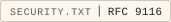

# Security

## Reporting

Report security issues to the contact published in
[`/.well-known/security.txt`](https://trentpower.fr/.well-known/security.txt),
encrypted if you prefer with the published PGP key at
[`/.well-known/pgp-key.asc`](https://trentpower.fr/.well-known/pgp-key.asc)
(fingerprint `A729 591B 450D 3F59 3694 98BD 8299 1F25 04AE 0263`).

Suspected vulnerabilities can also be reported privately through GitHub:
[open a private vulnerability report](https://github.com/trentpower/trentpower.fr/security/advisories/new).
The report stays between you and the maintainer until a fix is published.

Expect an initial response within 14 days. Confirmed issues are triaged, fixed
in the next edition, and disclosed coordinately once the fix is published; this
is the coordinated vulnerability disclosure window the project commits to.

Please do not open a public issue for anything sensitive.

## Disclosure

Confirmed vulnerabilities are published as GitHub Security Advisories (GHSA) on
this repository once a fix has shipped, with a CVE requested where applicable, so
there is a public record of what was found and corrected. None have been reported
to date. Dependency vulnerabilities that do not affect the published static site
are recorded, with their reason, in the VEX
([security/openvex.json](security/openvex.json)).

## Posture

The site's security and privacy posture — CSP, cross-origin isolation, HSTS,
the public-exposure allow-list, secret handling — is documented in
[docs/SECURITY-AND-PRIVACY.md](docs/SECURITY-AND-PRIVACY.md). Incident
handling is documented in
[docs/INCIDENT-RESPONSE.md](docs/INCIDENT-RESPONSE.md).

Every release is gated by blocking security checks before deploy; see
[docs/GATES-CHECKS-AND-QUALITY.md](docs/GATES-CHECKS-AND-QUALITY.md).

OpenSSF Scorecard runs weekly as an automated repository security
posture check ([scorecard.yml](.github/workflows/scorecard.yml)). It
helps surface risky supply-chain practices in the public repository and
workflow configuration. It is advisory evidence, not cryptographic
proof — the site's proof chain remains the signed manifest, source
mirrors and release archives ([docs/github-releases.md](docs/github-releases.md)).
